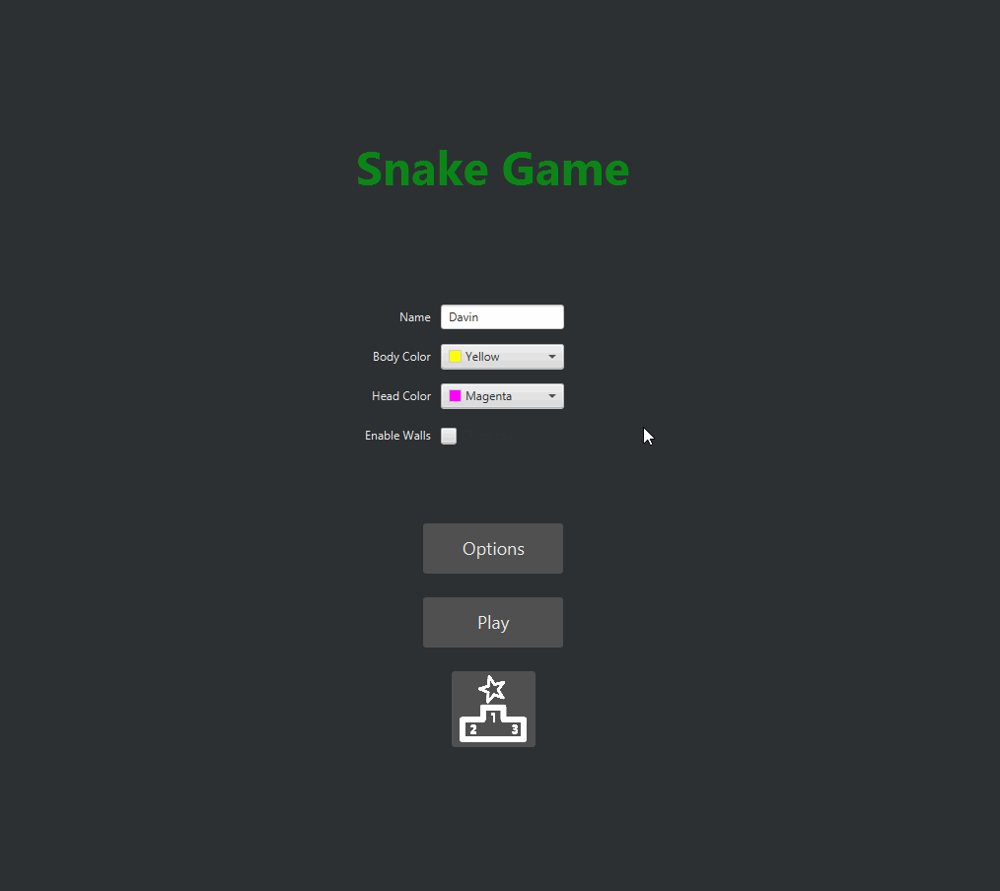

<h1 align="center">
  Snake Game
   
</h1>

<h4 align="center">A personalized version of the classic snake game written in java.</h4>

  

 

  <a href="#key-features">Key Features</a> •
  <a href="#technology">Technology</a> •
  <a href="#how-to-use">How To Use</a>

## Key Features

* Customizable snake colors
* High score board where you can view and sort scores by name, value, and time
* Music and sound effects with adjustable volume
* Dark theme that is easy on the eyes

## Technology

* JavaFX
* Maven
* CSS

## How To Use

<b>Note - This project currently requires:</b> 
An IDE such as [IntelliJ IDEA](https://www.jetbrains.com/idea/download/) as well as [Maven](https://maven.apache.org/)

<b>Steps:</b>
1. Clone the project - https://github.com/DavinPro/Snake-Game.git
2. Compile the project using the maven-compiler-plugin
3. Run `src/main/java/com/github/davinpro/App.java` using the javafx-maven-plugin
